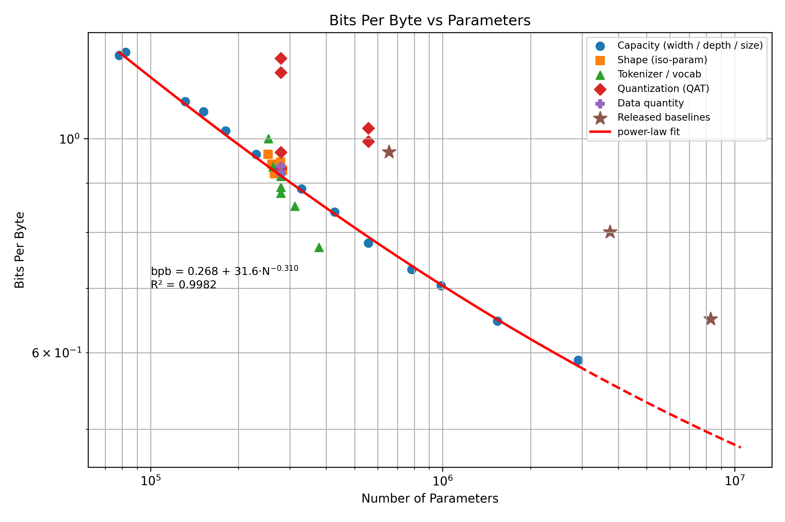
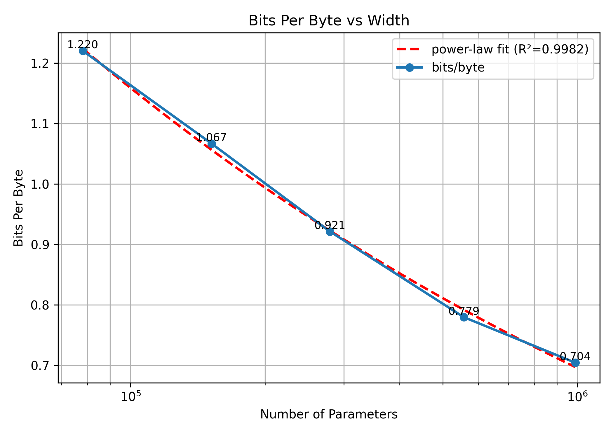
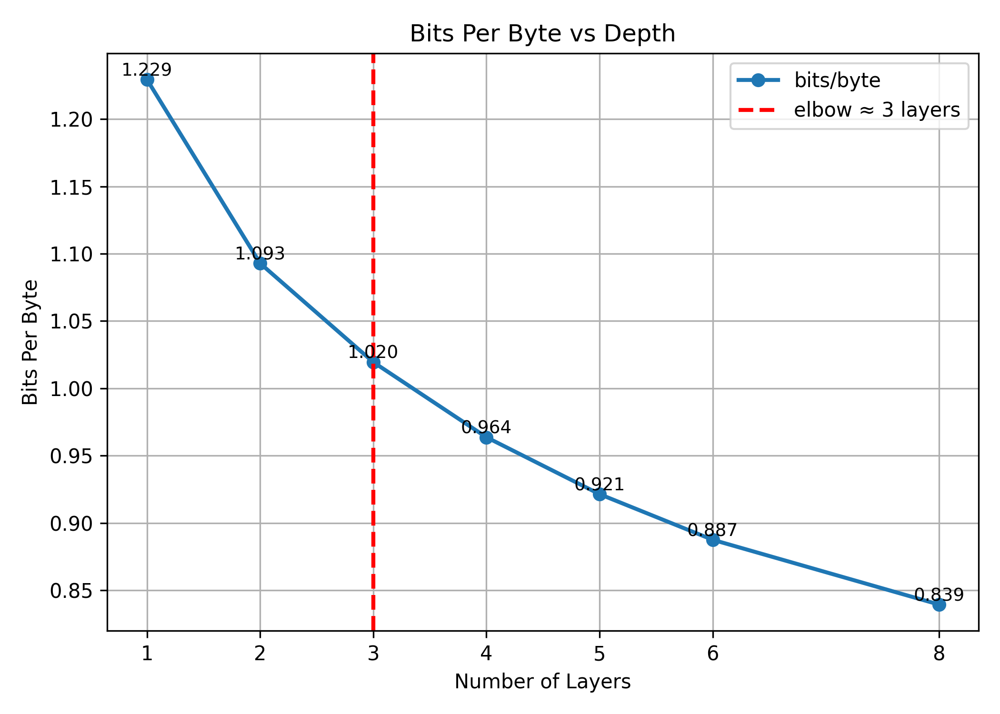
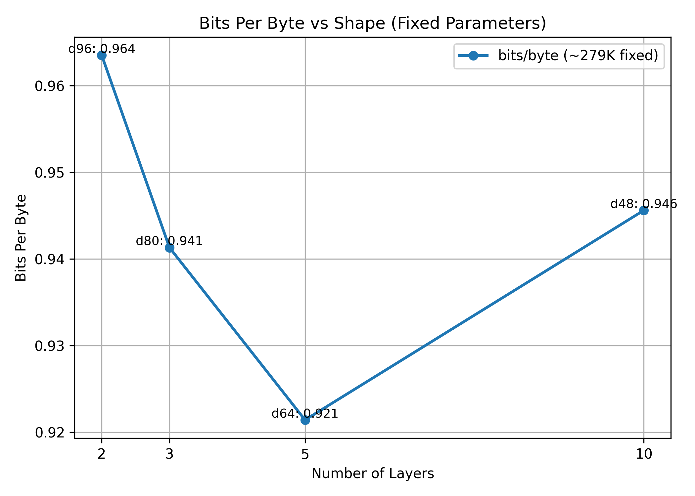
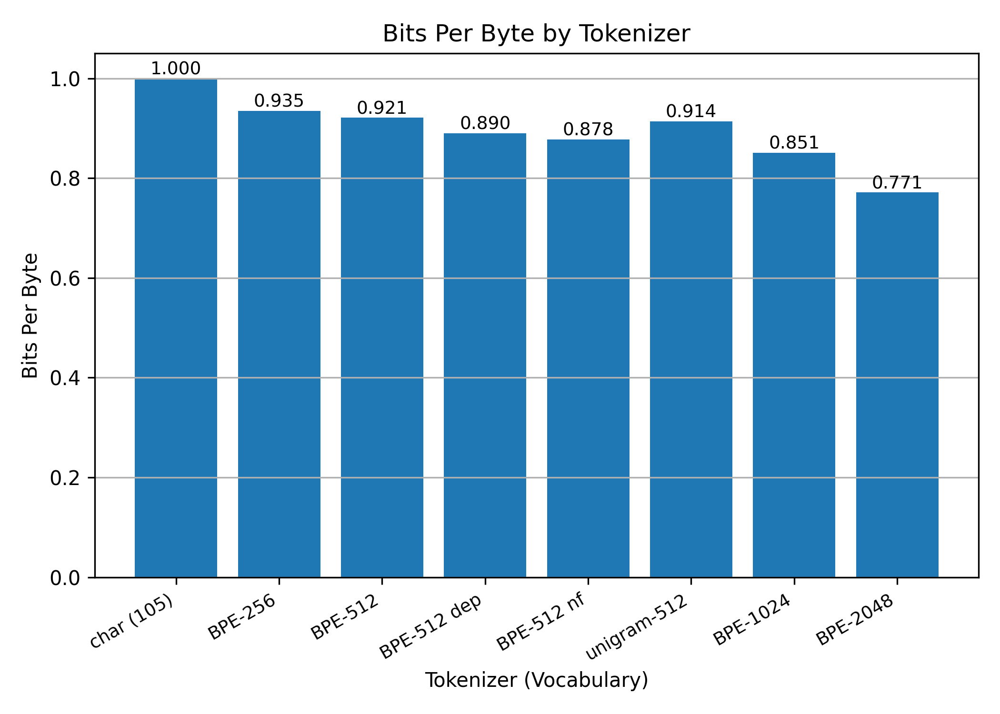
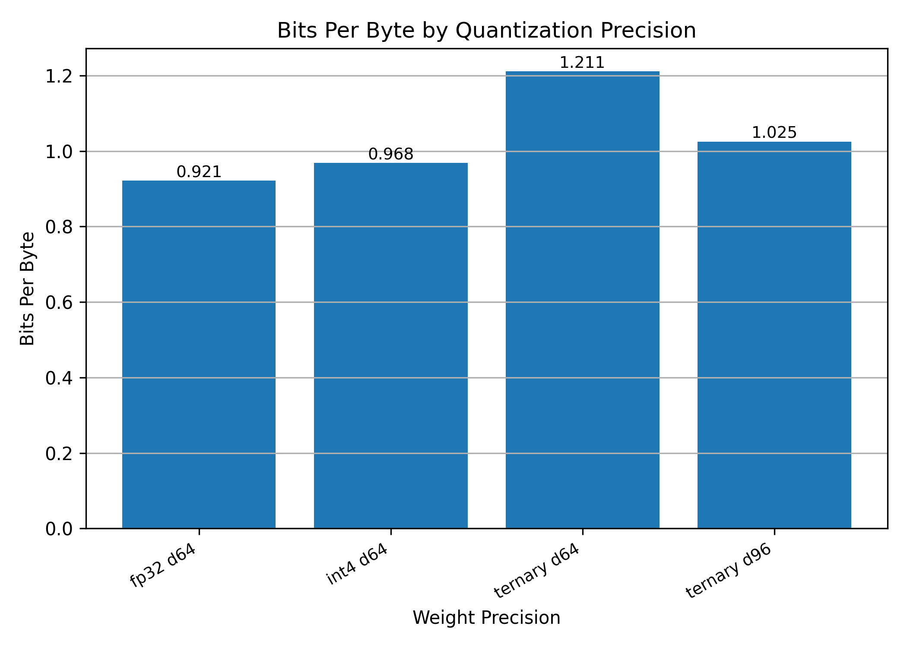
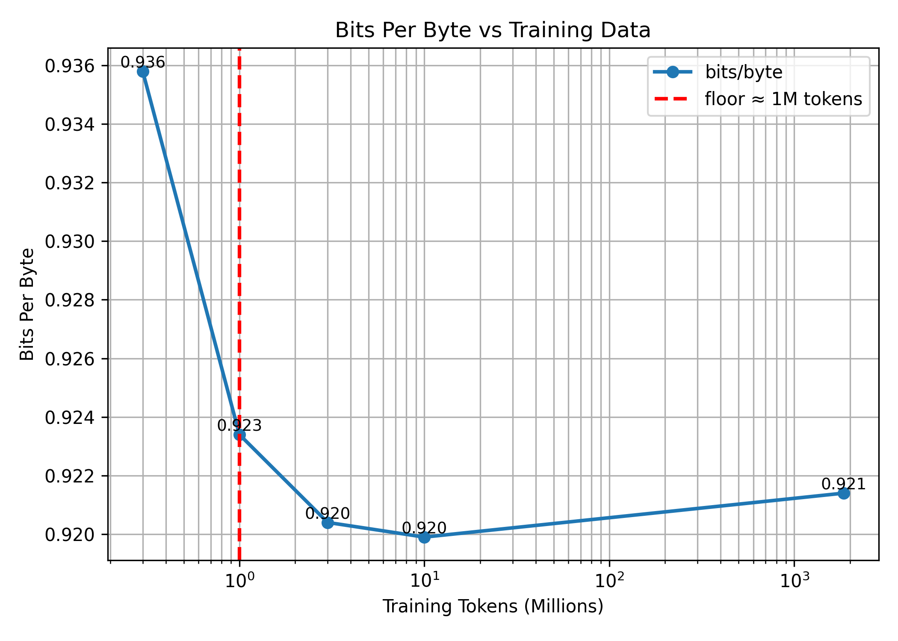
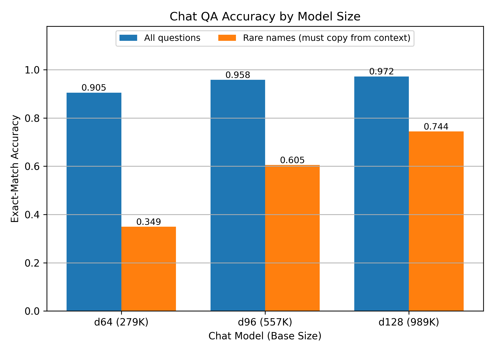

# TinyLM: How Small Can a Language Model Be and Still Write Coherent Stories?

## What this project is

This project trains a family of very small language models, from **78 thousand to roughly one million
parameters**, on the **TinyStories** dataset of simple children's stories, and measures how quality
changes with size. Each design choice is varied independently: model width, depth, the split of a
fixed budget between width and depth, the tokenizer, weight quantization, and training-set size. Every
model is trained to convergence for a fair comparison, and the full family is placed on a single
scaling curve. The best models are then instruction-tuned into small question-answering models and
evaluated on the same basis.

This project is based on and takes direct inspiration from:
> *TinyStories: How Small Can Language Models Be and Still Speak Coherent English?*, Ronen Eldan and Yuanzhi Li, 2023 — [arXiv:2305.07759](https://arxiv.org/abs/2305.07759)

**Why so small?** The target is a language model that runs on a **microcontroller**: an ESP32, the
class of low-cost chip found in a smart plug, with a few hundred kilobytes of memory. At that scale
every kilobyte matters, and the governing question is quality per parameter, meaning which design
choices deliver the most improvement for each stored weight. The training and inference engine is an
adapted fork of Andrej Karpathy's [llama2.c](https://github.com/karpathy/llama2.c), reduced to the
sub-million-parameter regime.

---

## Background: the models and how we measure them

**What the model does.** A language model reads text one token at a time and predicts the next.
Trained on thousands of simple stories, even a tiny model learns the structure of the language: that
sentences have subjects and verbs, and that a story introduces a character and then acts on them. It
can then generate new stories of its own. TinyStories showed that with sufficiently simple content, a
model of a few million parameters already writes fluent, coherent English. This project extends that
question downward, toward the size that fits on a chip.

**How we score it: bits per byte.** Different tokenizers divide text into different-sized pieces, so
loss per token is not comparable across them. **Bits per byte** measures the number of bits the model
needs to encode one byte of raw text. It is a tokenizer-independent measure of how well the model has
learned the language, and **lower is better**.

```
bits/byte = (validation loss in nats/token) × (tokens per byte) ÷ ln 2
```

**The scaling-law form.** To describe how quality improves with size we fit the standard
Kaplan/Chinchilla offset power law, in which loss falls with parameter count `N` toward an
"irreducible" floor `E`:

```
loss = E + A · N^(−α)
```

**The design choices varied**, one at a time with all else held fixed: **width** (information carried
per token), **depth** (number of layers), **shape** (how a fixed budget splits between width and
depth), **tokenizer** (how text is segmented), **quantization** (bits per stored weight, which sets
the on-device size), and **training data** (amount of text seen). The architecture is a LLaMA-style
decoder transformer (RoPE positions, RMSNorm, SwiGLU feed-forward, grouped-query attention), scaled to
hundreds of thousands of parameters.

---

## Project structure

```
README.md                 This file
RESEARCH_LOG.md           Detailed chronological methodology and every experiment
requirements.txt          Python dependencies

tinylm/                   Training & inference engine (adapted from karpathy/llama2.c)
  model.py                The transformer (RoPE, RMSNorm, SwiGLU, grouped-query attention, QAT hooks)
  train.py                Pre-training loop (single-variable sweeps run through here)
  build_master.py         Reads every trained checkpoint -> one clean master_data.csv
  sample.py               Generate stories from a checkpoint
  tokenizer.py            SentencePiece tokenizer wrapper
  run_*.sh                The exact commands used for each convergence sweep (reproducible record)
  rag_poc/                Chat / question-answering use-case
    gen_qa_data.py        Builds synthetic QA pairs from the stories
    finetune_qa.py        Instruction-tunes a base checkpoint into a QA "chat" model
    eval_qa.py            Exact-match evaluation of a chat model on held-out QA
    rag_demo.py           End-to-end retrieval + answer demo

figures/                  All graphs, regenerated from reports/master_data.csv
  scaling_figure.png      Every-model bits/byte-vs-parameters scaling figure
  ablation_*.png          The six single-variable ablation plots
  chat_compare.png        Chat/QA accuracy by model size

reports/                  Data table, figure generators, and write-ups
  master_data.csv         One row per trained model (config, params, val loss, bits/byte)
  make_*.py               Scripts that regenerate the figures from master_data.csv

docs/
  tiny-model-methods-research.md   Literature survey (tiny LMs, MCU deployment, applications)
```

The two halves are separated: **`tinylm/` produces the models and the numbers**, and
**`reports/make_*.py` turns `master_data.csv` into the graphs in `figures/`**. Every figure is
generated from the data table, so the numbers in this README and the figures remain consistent.

---

## Running it

```bash
# 1. environment
python -m venv .venv
.venv/Scripts/python -m pip install -r requirements.txt

# 2. rebuild the master data table from the trained checkpoints
cd tinylm && python build_master.py            # -> ../reports/master_data.csv

# 3. regenerate all figures from that table
python reports/make_scaling_figure.py
python reports/make_ablation_plots.py
python reports/make_chat_compare.py

# 4. (optional) train a model, generate a story, fine-tune a chat model
python tinylm/train.py --vocab_source=custom --vocab_size=512 --dim=64 --n_layers=5 --max_iters=30000 --out_dir=out_demo
python tinylm/sample.py --checkpoint=out_demo/ckpt.pt --start="Once upon a time"
python tinylm/rag_poc/finetune_qa.py --ckpt_dir out_width_d128_long --data rag_poc/qa512_train.jsonl --out_dir out_chat_demo
```

The exact commands used for every convergence sweep are preserved in `tinylm/run_*.sh`.

---

## Results

All numbers below are **bits per byte on held-out text, at convergence**. Lower is better. The full
table is in [`reports/master_data.csv`](reports/master_data.csv).

### Scaling law across the full family



Every trained model sits on one log-log plot of bits/byte against size. The red line is the offset
power law fit to the controlled width sweep:

```
bits/byte = 0.012 + 15.3 · N^(−0.225)      (R² = 0.998)
```

The fit (R² = 0.998) supports two conclusions. First, bits per byte follows a power law in parameter
count across the full range tested, from 78 K to roughly one million parameters: each doubling of size
produces a near-constant proportional reduction in loss. Second, the irreducible term `E` fits to
approximately zero and is never reached. The models show no saturation within this range; loss is
still falling at the largest size measured, indicating performance bounded by capacity rather than by
an intrinsic floor.

Extended beyond the models trained here (dashed segment), the fitted line reaches the two released
TinyStories models, at 3.75 M and 8.3 M parameters, despite their substantially larger tokenizer. The
sub-million-parameter models therefore lie on the same scaling trend as the published baselines.

### Width, depth, and shape

The most reliable lever is **width**. Widening the model produces a smooth, predictable reduction in
bits/byte with no diminishing returns across the range tested:



| Width | Parameters | bits/byte |
|-------|-----------|-----------|
| 32 | 78 K | 1.220 |
| 48 | 152 K | 1.067 |
| 64 | 279 K | 0.921 |
| 96 | 557 K | 0.780 |
| 128 | 989 K | 0.704 |

**Depth** also helps, with clearly diminishing returns. Most of the benefit appears in the first
three layers; beyond that, each layer costs roughly its share of parameters for a smaller gain, and
the curve has not flattened by eight layers. This is consistent with the TinyStories finding that at
least two layers are required before a model produces basic sentence structure.



**Shape** concerns a fixed parameter budget and whether to spend it on width or depth. Holding the
size near 279 K, the sweep runs from wide-and-shallow to deep-and-narrow. Neither extreme is best; the
balanced configuration in the middle wins:



An earlier version of this study compared only the two extreme shapes and concluded that deeper was
better. Adding the interior points showed that conclusion to be an artifact of sampling only the
endpoints: with the full sweep, the balanced d64/5-layer model outperforms both the wide-shallow and
deep-narrow configurations. A fixed budget spent too heavily on either axis is wasted.

### Training budget

The first sweeps trained every model for 5,000 steps to limit GPU time, and several conclusions were
drawn from them: that one shape beat another, and that width mattered more than depth. Retraining the
full family to convergence at 30,000 steps reversed some of those conclusions. The 989 K model
improved from 0.82 to 0.70 bits/byte from longer training alone, and the shape result inverted as
described above.

Training budget is a confound in architecture comparisons. A short budget systematically penalizes
models that converge more slowly, deeper models in particular. All results in this README are reported
at convergence, so no comparison is affected by differences in training duration.

### Tokenizer, quantization, and data

**Tokenizer.** A coarser vocabulary compresses this text better: bits/byte falls steadily from
character-level (1.000) to a 2048-word vocabulary (0.771), and a no-fallback BPE-512 tokenizer
outperforms the standard one. The caveat is that a larger vocabulary also enlarges the embedding
table, so this is not a parameter-matched comparison; part of the gain is additional parameters.



**Quantization** determines the on-device footprint. Quantization-aware training for 4-bit weights
(int4) costs almost nothing: 0.968 against 0.921 for full precision, at an eightfold smaller weight
footprint. Ternary (1.58-bit) weights break at this width and recover only partially when the model is
widened, so widening does not fully compensate. Below 8 bits, stored bytes and parameter count
diverge, and a ternary model can remain the smallest artifact on the chip even when its bits/byte is
somewhat higher.



**Training data** has little effect. The model reaches its floor at roughly one million tokens, and
300 thousand tokens (0.016% of the full dataset) lands within 0.015 bits/byte of training on the
entire set. These models are limited by their own capacity rather than by data volume, and extract
nearly everything available from a small fraction of it.



### Comparison to the released models

The released TinyStories checkpoints were scored with the same per-model protocol as ours:

| Model | Parameters | bits/byte |
|-------|-----------|-----------|
| **Ours, converged (width 128)** | **989 K** | **0.704** |
| TinyStories-1M (released) | 3.75 M | 0.800 |
| TinyStories-3M (released) | 8.3 M | 0.650 |
| raincandy TinyStories-656K | 656 K | 0.969 |

The converged 989 K model reaches **lower bits/byte than the released 1M-class checkpoint using 3.8×
fewer parameters**. It is exceeded only by the 3M-class model, which is more than eight times its size.

### Instruction-tuned question answering

The three converged models were each instruction-tuned on synthetic question-answering pairs,
producing a small model that reads a short passage and answers a question about it. Exact-match
accuracy was measured on 600 held-out questions:



| Chat model | All questions | Rare names (must copy from the passage) |
|-----------|--------------|-----------------------------------------|
| d64 (279 K) | 90.5 % | 34.9 % |
| d96 (557 K) | 95.8 % | 60.5 % |
| **d128 (989 K)** | **97.2 %** | **74.4 %** |

On easy questions the three models are close. The distinguishing case is the rare-names column:
questions whose answer is an unusual name the model must **copy from the passage** rather than recall
from training. This is the hardest case for a small model, and accuracy rises with size, from 35% to
61% to 74%.

---

## Figures

Every figure is generated from `reports/master_data.csv` by the scripts listed below.

| File | What it shows | Regenerate with |
|------|---------------|-----------------|
| `figures/scaling_figure.png` | Every model, bits/byte vs parameters, offset power-law fit | `python reports/make_scaling_figure.py` |
| `figures/ablation_{width,depth,shape,tokenizer,quant,data}.png` | The six single-variable ablations | `python reports/make_ablation_plots.py` |
| `figures/chat_compare.png` | Chat/QA accuracy by model size | `python reports/make_chat_compare.py` |

---

## Limitations

- **Bits per byte is a compression score, not a story-quality judgement.** A separate blinded panel of
  language-model judges found that lower bits/byte does not always mean better stories: how well a
  model compresses text and how well it writes freely can come apart (see `RESEARCH_LOG.md`).
- The tokenizer comparison is **not parameter-matched**: a larger vocabulary brings a larger embedding
  table, so some of its advantage is simply extra parameters.
- The shape sweep is only **approximately** equal-size (252 K–279 K). The cleanest matched comparison
  is the balanced model against the deep-narrow one at exactly 279 K, where the balanced shape wins.
- The released baselines use a different tokenizer and training recipe, so they are shown for context
  and left out of the scaling-law fit itself.
- On-device deployment to the ESP32 is the motivation and a separate demo exists, but the scaling
  study here is measured on a workstation GPU, not on the microcontroller itself.

---

## References

The question this project asks, and the scaling-law form we fit:

- Eldan & Li, *TinyStories: How Small Can Language Models Be and Still Speak Coherent English?*, 2023 — [arXiv:2305.07759](https://arxiv.org/abs/2305.07759)
- Kaplan et al., *Scaling Laws for Neural Language Models*, 2020 — [arXiv:2001.08361](https://arxiv.org/abs/2001.08361) — the `L = E + A·N^−α` form we fit to the width sweep.
- Hoffmann et al., *Training Compute-Optimal Large Language Models* (Chinchilla), 2022 — [arXiv:2203.15556](https://arxiv.org/abs/2203.15556) — the training-budget confound we ran into is the same effect this paper formalizes.

Work on small and on-device language models at comparable scale, which motivates the design choices we
swept (grouped-query attention, embedding sharing, depth-vs-width, distillation, data quality):

- Liu et al., *MobileLLM: Optimizing Sub-billion Parameter Language Models for On-Device Use Cases*, 2024 — [arXiv:2402.14905](https://arxiv.org/abs/2402.14905)
- Timiryasov & Tastet, *Baby Llama: knowledge distillation from an ensemble of teachers…*, 2023 — [arXiv:2308.02019](https://arxiv.org/abs/2308.02019)
- Li et al., *Textbooks Are All You Need II (phi-1.5)*, 2023 — [arXiv:2309.05463](https://arxiv.org/abs/2309.05463)
- Nguyen et al., *A Survey of Small Language Models*, 2024 — [arXiv:2410.20011](https://arxiv.org/abs/2410.20011)

Running language models on microcontrollers and the extreme edge, the eventual deployment target:

- Jung et al., *Optimizing the Deployment of Tiny Transformers on Low-Power MCUs*, 2024 — [arXiv:2404.02945](https://arxiv.org/abs/2404.02945)
- Yang et al., *MCUBERT: Memory-Efficient BERT Inference on Commodity Microcontrollers*, 2024 — [arXiv:2410.17957](https://arxiv.org/abs/2410.17957)
- Zheng et al., *A Review on Edge Large Language Models: Design, Execution, and Applications*, 2024 — [arXiv:2410.11845](https://arxiv.org/abs/2410.11845)

The base implementation this engine is adapted from:

- Karpathy, *llama2.c* — https://github.com/karpathy/llama2.c

*A fuller literature survey, including microcontroller-deployment engineering and application case
studies, is in [`docs/tiny-model-methods-research.md`](docs/tiny-model-methods-research.md).*
